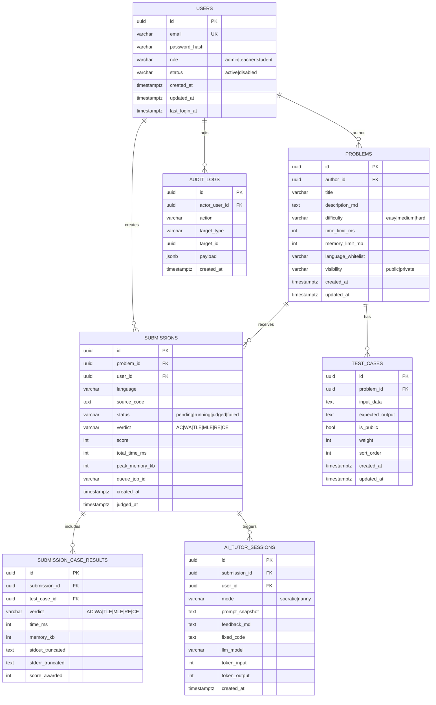
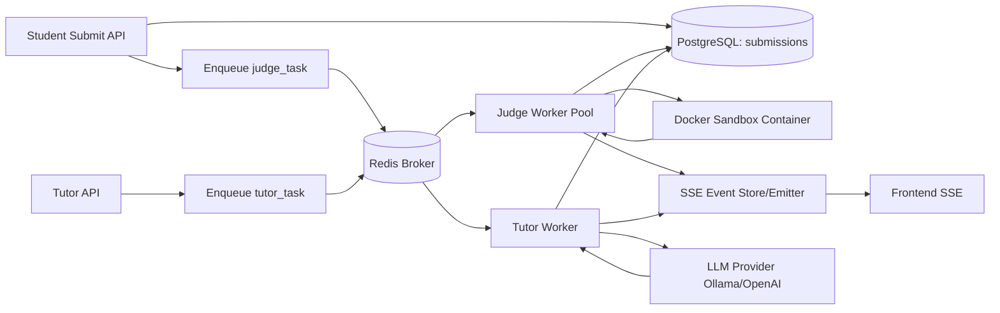

# Q-Sandbox v2.0 技术蓝图（可执行版）

> 面向：从 Milestone 原型升级到可商用编程教学 SaaS。
> 
> 当前基线：已具备 `FastAPI + SSE + Docker 沙箱 + Ollama` 单链路。

---

## 1. 目标与边界

### 1.1 v2.0 目标
- 建立三端角色闭环：`Admin / Teacher / Student`（JWT + RBAC）
- 升级为 OJ 评测机：多用例逐例判题、资源限制、标准 verdict
- 接入 AI Tutor：Socratic / Nanny 双模式 + Diff 流式渲染
- 引入真实持久化：PostgreSQL + 结构化审计与统计

### 1.2 非目标（v2.0 暂不做）
- 多租户计费系统（可在 v2.1 扩展）
- 全语言生态（首期建议 C++ + Python）
- K8s 全面云原生（先用 Docker Compose/单机集群）

---

## 2. 后端技术栈与架构决策

## 2.1 栈总览
- **API 网关**：FastAPI
- **认证授权**：JWT（access + refresh）+ RBAC（角色+权限）
- **数据库**：PostgreSQL 16
- **ORM 与迁移**：SQLAlchemy 2.x + Alembic
- **异步任务**：Celery + Redis
- **容器判题**：Docker SDK（Python）+ 独立 judge worker
- **流式通道**：SSE（submission events / tutor stream）
- **可观测性**：Prometheus（已有指标接口延展）+ Loki（可选）
- **对象存储（可选）**：MinIO（日志、大文件、数据集）

## 2.2 核心架构分层
- `api`：HTTP 路由与参数校验
- `service`：业务编排（提交、判题、Tutor）
- `domain`：核心模型与状态机
- `repository`：数据库访问（ORM）
- `worker`：异步任务执行（judge/ai）
- `infra`：Docker/LLM/Redis/Postgres 客户端

---

## 3. 数据库 ER 图（v2.0）

> 使用 Mermaid ER 图，后续可同步到 migration 设计评审。



## 3.1 关键索引建议
- `users(email)` 唯一索引
- `problems(author_id, created_at)`
- `test_cases(problem_id, is_public, sort_order)`
- `submissions(user_id, created_at)`
- `submissions(problem_id, created_at)`
- `submission_case_results(submission_id, test_case_id)`
- `audit_logs(actor_user_id, created_at)`

---

## 4. 后端目录结构（目标态）

```text
backend/
  app/
    main.py
    api/
      deps/
        auth.py
        permission.py
      v1/
        auth.py
        admin.py
        teacher.py
        student.py
        problems.py
        test_cases.py
        submissions.py
        tutor.py
        metrics.py
    core/
      config.py
      logging.py
      security.py
      exceptions.py
      constants.py
    db/
      base.py
      session.py
      models/
        user.py
        problem.py
        test_case.py
        submission.py
        submission_case_result.py
        ai_tutor_session.py
        audit_log.py
      repositories/
        users_repo.py
        problems_repo.py
        test_cases_repo.py
        submissions_repo.py
        tutor_repo.py
    schemas/
      auth.py
      user.py
      problem.py
      test_case.py
      submission.py
      tutor.py
      metrics.py
      common.py
    services/
      auth_service.py
      problem_service.py
      submission_service.py
      judge_service.py
      tutor_service.py
      llm/
        base.py
        ollama_provider.py
      sandbox/
        compiler.py
        runner.py
        comparator.py
        limits.py
    workers/
      celery_app.py
      judge_tasks.py
      tutor_tasks.py
    infra/
      docker_client.py
      redis_client.py
      metrics.py
    migrations/
      versions/
  tests/
    api/
    integration/
    judge/
```

---

## 5. 核心 API 清单（v2.0）

## 5.1 Auth / RBAC
- `POST /api/v1/auth/register`（Admin 创建用户或自助注册视策略）
- `POST /api/v1/auth/login`
- `POST /api/v1/auth/refresh`
- `POST /api/v1/auth/logout`
- `GET /api/v1/auth/me`

## 5.2 Admin
- `GET /api/v1/admin/users`
- `POST /api/v1/admin/users`
- `PATCH /api/v1/admin/users/{user_id}/role`
- `PATCH /api/v1/admin/users/{user_id}/status`
- `GET /api/v1/admin/system/health`（docker/redis/postgres/ollama）
- `GET /api/v1/admin/system/metrics`（并发、队列长度、失败率）

## 5.3 Teacher
- `POST /api/v1/teacher/problems`
- `GET /api/v1/teacher/problems`
- `GET /api/v1/teacher/problems/{problem_id}`
- `PATCH /api/v1/teacher/problems/{problem_id}`
- `DELETE /api/v1/teacher/problems/{problem_id}`

- `POST /api/v1/teacher/problems/{problem_id}/test-cases`
- `PATCH /api/v1/teacher/test-cases/{case_id}`
- `DELETE /api/v1/teacher/test-cases/{case_id}`
- `GET /api/v1/teacher/problems/{problem_id}/test-cases`

- `POST /api/v1/teacher/problems/{problem_id}/ai-generate-cases`
- `GET /api/v1/teacher/analytics/problems/{problem_id}`
- `GET /api/v1/teacher/analytics/students/{student_id}`

## 5.4 Student
- `GET /api/v1/student/problems`（搜索、分页、难度过滤）
- `GET /api/v1/student/problems/{problem_id}`
- `GET /api/v1/student/problems/{problem_id}/public-test-cases`

- `POST /api/v1/student/submissions`
- `GET /api/v1/student/submissions/{submission_id}`
- `GET /api/v1/student/submissions/{submission_id}/events`（SSE）
- `GET /api/v1/student/submissions/history`

## 5.5 AI Tutor
- `POST /api/v1/tutor/sessions`（参数：submission_id, mode）
- `GET /api/v1/tutor/sessions/{session_id}`
- `GET /api/v1/tutor/sessions/{session_id}/stream`（SSE：点评+代码流）

## 5.6 公共/运维
- `GET /health`
- `GET /api/v1/metrics`
- `GET /api/v1/ready`（替换 README 中旧路径）

---

## 6. 任务队列拓扑（Celery + Redis）



## 6.1 队列拆分建议
- `queue:judge.high`：实时判题（学生提交）
- `queue:judge.low`：批量重判/回放
- `queue:tutor`：AI 辅导
- `queue:maintenance`：统计聚合、归档

## 6.2 幂等与重试
- 任务 ID 与 submission_id 绑定，重复投递幂等处理
- `judge_task` 失败可重试 1~2 次（仅系统错误）
- 业务性错误（CE/WA/TLE）不重试

---

## 7. 判题引擎执行规范（Sandbox v2）

## 7.1 单提交执行流程
1. 拉取题目限制（time/memory/language）
2. 编译（如 C++）并捕获编译输出
3. 挂载隐藏+公开测试用例（只读）
4. 逐用例执行（stdin 重定向）
5. 对比输出并记录每例 verdict
6. 汇总 score / 总 verdict / 峰值资源
7. 回写 DB，并推送 SSE 终态事件

## 7.2 安全基线
- 禁止容器网络（`network_disabled=True`）
- 限制 CPU、内存、PIDs
- 只挂载工作目录和只读测试文件
- stdout/stderr 设截断上限（防日志爆炸）
- 超时即 kill 容器并标记 TLE

---

## 8. AI Tutor 协议（SSE 事件约定）

## 8.1 事件类型
- `tutor.start`
- `tutor.feedback.delta`（Markdown 点评增量）
- `tutor.code.delta`（修复代码增量，行级）
- `tutor.diff.ready`（可渲染 diff）
- `tutor.end`

## 8.2 请求参数
- `mode: socratic | nanny`
- `submission_id`
- `language`
- `student_code`
- `compile_error / failed_cases`

## 8.3 输出约束
- Socratic：禁止输出完整可运行答案
- Nanny：允许完整修复代码，必须含中文注释

---

## 9. 每阶段工时预估（Phase 1~4）

> 口径：1 人全职后端 + 1 人前端 + 0.5 人测试/运维支持。
> 单位：工作日（WD）。

| Phase | 目标 | 后端 | 前端 | 测试/联调 | 合计（并行后） |
|---|---|---:|---:|---:|---:|
| Phase 1 | 数据库 + JWT + RBAC + 基础 CRUD | 12 WD | 6 WD | 4 WD | **14~16 WD** |
| Phase 2 | OJ 多用例评测 + Celery 队列 + 提交流 | 15 WD | 7 WD | 6 WD | **18~21 WD** |
| Phase 3 | Teacher/Admin 业务闭环 + 学情面板 | 12 WD | 10 WD | 5 WD | **16~18 WD** |
| Phase 4 | AI Tutor 双模式 + Monaco Diff 流式注入 | 14 WD | 12 WD | 6 WD | **20~24 WD** |

**总计建议：**约 `68 ~ 79` 工作日（约 14~16 周，可并行压缩到 10~12 周）。

---

## 10. Phase 交付清单（Definition of Done）

## 10.1 Phase 1 DoD
- [ ] Alembic 首版迁移可一键初始化
- [ ] JWT 登录/刷新可用
- [ ] Admin/Teacher/Student 权限隔离通过测试
- [ ] Users/Problems/TestCases/Submissions 基础 CRUD 完成

## 10.2 Phase 2 DoD
- [ ] 多用例逐例判题结果准确
- [ ] AC/WA/TLE/MLE/RE/CE 结果稳定
- [ ] 提交 SSE 流状态完整
- [ ] 并发压测下队列可控（失败可重试）

## 10.3 Phase 3 DoD
- [ ] 教师可完整出题、配置公开/隐藏用例
- [ ] 管理员可查看系统健康与关键指标
- [ ] 学情统计可按学生/题目维度查询

## 10.4 Phase 4 DoD
- [ ] Tutor 双模式策略生效
- [ ] Diff 界面支持流式注入修复代码
- [ ] Tutor 结果可追溯（session 落库）
- [ ] 成本与频控策略上线

---

## 11. 里程碑风险与缓解

- **判题安全风险**：先以单语言收敛 + 最小权限容器策略上线
- **AI 成本风险**：引入配额与缓存，教师端优先开放
- **并发性能风险**：任务队列分级 + worker 水平扩容
- **需求蔓延风险**：每期冻结范围，新增需求进下一期 backlog

---

## 12. 下一步（本周可执行）

1. 建立 `db/models + alembic` 骨架（Phase 1）
2. 完成 `auth + rbac` 最小链路
3. 搭建 `celery + redis + judge_worker` 空任务流
4. 确认并固化 `submission/tutor` SSE 事件协议
5. 补齐 `GET /api/v1/ready` 与 README 对齐

---

## 附录 A：最小环境变量建议

```env
APP_ENV=dev
LOG_LEVEL=INFO

POSTGRES_HOST=postgres
POSTGRES_PORT=5432
POSTGRES_DB=qsandbox
POSTGRES_USER=qsandbox
POSTGRES_PASSWORD=qsandbox

REDIS_URL=redis://redis:6379/0

JWT_SECRET_KEY=change_me
JWT_ACCESS_EXPIRE_MINUTES=30
JWT_REFRESH_EXPIRE_DAYS=7

OLLAMA_BASE_URL=http://host.docker.internal:11434
OLLAMA_MODEL_NAME=myqwen:latest

SANDBOX_DOCKER_IMAGE=gcc:13
SANDBOX_TIMEOUT_SECONDS=5
SANDBOX_MEMORY_LIMIT=256m
SANDBOX_CPU_QUOTA=50000
```

## 附录 B：状态码与 verdict 约定
- 提交创建成功：`202 Accepted`
- 查询不存在：`404`
- 权限不足：`403`
- 登录失效：`401`
- verdict：`AC / WA / TLE / MLE / RE / CE`
